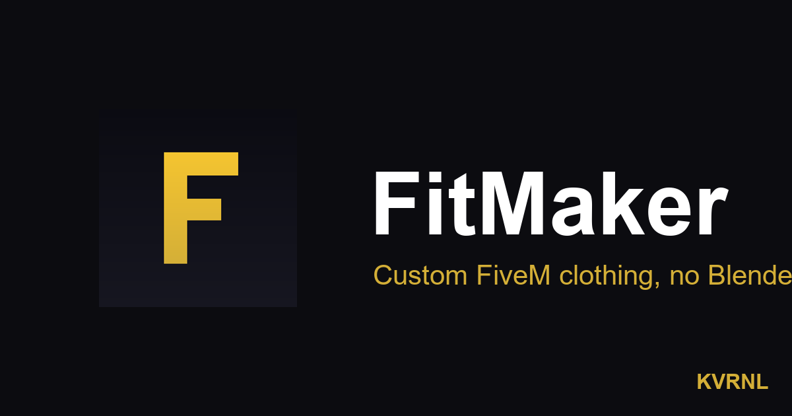

# FitMaker

### Custom FiveM clothing, no Blender needed

 

Design custom clothing for your FiveM server without Blender, OpenIV, or CodeWalker. Restyle a base garment with colours, patterns, and your own logos, preview it in 3D on the freemode ped, and export a drop-in resource that streams straight onto your server.

### **[⬇&nbsp; Download FitMaker — free at kvrnl.io](https://kvrnl.io/products/fitmaker/)**

 

---

## What it does

FitMaker takes the pain out of making FiveM clothing. Pick a base garment, recolour it, drop on patterns and your own logos, and watch it update live in 3D on the male or female freemode ped — no Blender, no OpenIV, no CodeWalker, and none of the modelling knowledge they usually demand.

When it looks right, FitMaker exports a clean, drop-in resource folder that streams straight onto your server — correctly named and ready to go. The heavy 3D engine it needs sets itself up on first run, so there's nothing to install by hand. Free to use; claim your license key and download it straight from this page.

## Features

- **Restyle base garments — colours, patterns & your own logos**
- **Live 3D preview on the male or female freemode ped**
- **Exports a drop-in resource that streams onto your server**
- **No Blender, OpenIV, or CodeWalker — it's all built in**

## Download &amp; install

FitMaker is **completely free**. Each install needs its own license key, which you get
with a free KVRNL account.

1. Go to **[kvrnl.io/products/fitmaker/](https://kvrnl.io/products/fitmaker/)**
2. Create a free account — email verification, nothing else
3. Claim your license key — instant, no waiting
4. Download and install

> [!NOTE]
> FitMaker isn't code-signed yet, so Windows SmartScreen may warn you on first run.
> Click **More info → Run anyway**. Code signing is on the roadmap.

## Your license key

- **Free, one per product**, issued from your KVRNL account.
- **A key activates on one machine.** The first device to activate it claims it.
- **Switching computers?** Hit **Release device** on your
  [account page](https://kvrnl.io/account/) and the key is free to use again.
- Keys are checked over HTTPS at launch. See [Privacy](#privacy).

## Requirements

- **Windows 10 or 11** (64-bit)
- A free [KVRNL account](https://kvrnl.io/signup/) for your license key

## Privacy

FitMaker sends KVRNL only what's needed to validate your license: **the key, the
product name, and a hardware ID**. No telemetry, no analytics, no tracking, and
none of your files. Full policy: **[kvrnl.io/privacy](https://kvrnl.io/privacy/)**

## What's new

**v1.0.23** — 2026-07-21
  - Fixed the design-bake so the exported model keeps its geometry and your texture together.

**v1.0.22** — 2026-07-21
  - Your design now actually bakes into the exported clothing model (rebuilt the export so the texture sticks).

**v1.0.21** — 2026-07-21
  - Behind-the-scenes work on the clothing texture export engine.

**v1.0.20** — 2026-07-21
  - Fixed the exported clothing not registering on servers (removed a bad metadata reference) and made the design-bake verify itself.

**v1.0.19** — 2026-07-21
  - Your design now gets baked into the clothing model itself on export — the first working end-to-end custom garment.

Full history → **[kvrnl.io/changelog/fitmaker](https://kvrnl.io/changelog/fitmaker/)**

## Documentation

Setup guides and how-tos → **[kvrnl.io/docs/fitmaker](https://kvrnl.io/docs/fitmaker/)**

## Support

> [!IMPORTANT]
> **We don't use GitHub Issues.** Report bugs from inside the app — it's the
> fastest route to us and it attaches the details we need automatically.

- 🐛 **Found a bug?** Use **Report a Problem** inside FitMaker
- 💬 **Chat with us** → **[Discord](https://discord.gg/Ub4SdAuhu)**
- ✉️ **Anything else** → **[kvrnl.io/contact](https://kvrnl.io/contact/)**
- ❓ **FAQ** → [kvrnl.io/faq](https://kvrnl.io/faq/)

## License

**Proprietary freeware — free to use, not open source.**

This repository hosts the installer releases, documentation, and license for
FitMaker. **The application source code is not published.** See
**[LICENSE](./LICENSE)** for the full terms.

---

 

**[kvrnl.io](https://kvrnl.io)** &nbsp;·&nbsp; **[All products](https://kvrnl.io/products/)** &nbsp;·&nbsp; **[Changelog](https://kvrnl.io/changelog/)** &nbsp;·&nbsp; **[Discord](https://discord.gg/Ub4SdAuhu)** &nbsp;·&nbsp; **[Contact](https://kvrnl.io/contact/)**

© 2026 <b>KVRNL</b> — an AI-powered software studio shipping free desktop tools.

